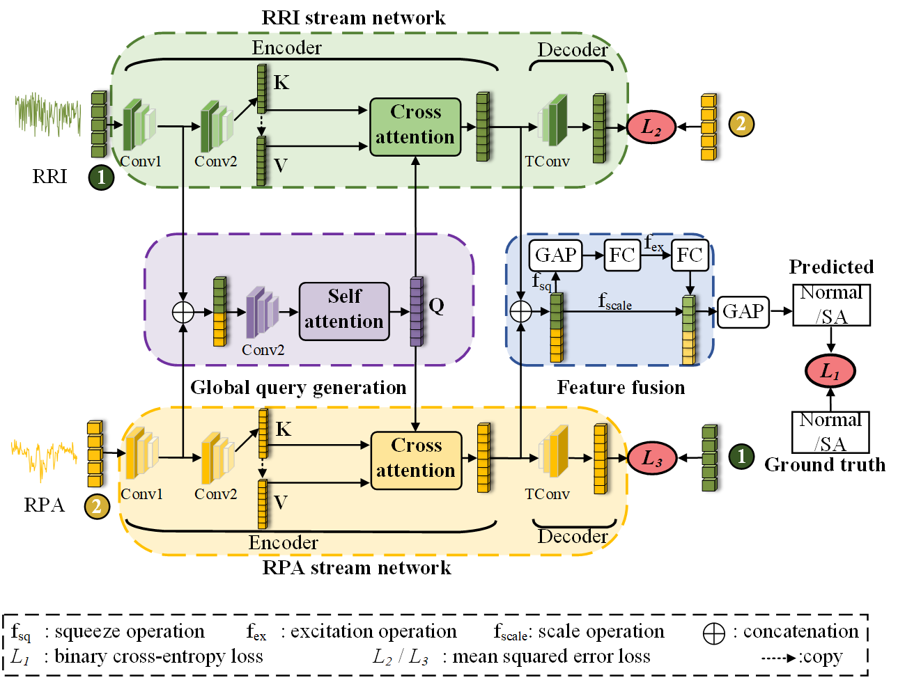

<!-- # BAFNet: Bottleneck Attention Based Fusion Network for Sleep Apnea Detection

## Abstract
Sleep apnea (SA) is a common sleep-related breathing disorder, which tends to induce a series of complications such as pediatric intracranial hypertension, psoriasis, and even sudden death. Therefore, early diagnosis and treatment can effectively prevent malignant complications. Portable monitoring (PM) is a widely used tool for people to monitor their sleep conditions out of hospital. In this study, we focus on SA detection based on single-lead ECG signals which are easily collected by PM. We propose a bottleneck attention based fusion of deep neural network named BAFNet, which mainly includes five parts of RRI (R-R intervals) stream network, RPA (R-peak amplitudes) stream network, global query generation, feature fusion, and classifier. To learn the feature representation of RRI/RPA segments, fully convolutional networks (FCN) with cross-learning are proposed. Meanwhile, to control the feature information flow in RRI/RPA stream network, a global query generation with bottleneck attention is proposed. To further improve the SA detection performance, a hard sample scheme with k-means clustering is employed. Experiment results show that BAFNet can achieve competitive results, which is superior to the state-of-the-art SA detection methods. It means that BAFNet has a great potential to be applied in home sleep apnea test (HSAT) for sleep conditions monitoring.

## Dataset
[Apnea-ECG Database](https://physionet.org/content/apnea-ecg/1.0.0/)

## Usage

1. Get the pkl file
- Download the dataset Apnea-ECG Database
- Run [Preprocessing.py](Preprocessing.py) to get a file named apnea-ecg.pkl

2. Per-segment classification
- Run [BAFNet.py](BAFNet.ipynb)

3. Per-recording classification  
- Run [evaluate.py](utils/code_for_calculating_per-recording/evaluate.py)
- The performance is shown in [Table.csv](utils/code_for_calculating_per-recording/output/Table.csv)

## Cite
Not yet published
 If our work is helpful to you, please cite: 

## Email
If you have any questions, please email to: [xhchen@m.scnu.edu.cn](mailto:xhchen@m.scnu.edu.cn)
 -->
